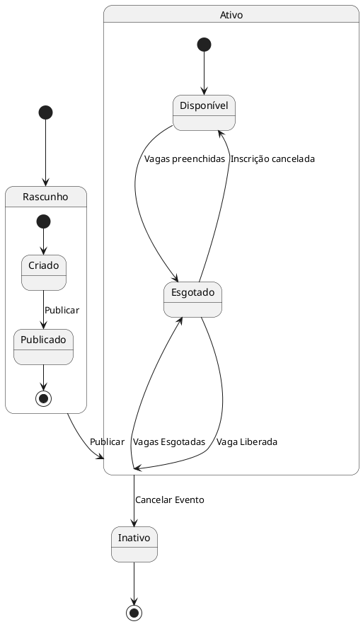

# Especificação de Requisitos - Módulo de Eventos (SIGEEV)

## Índice

- [Especificação de Requisitos - Módulo de Eventos (SIGEEV)](#especificação-de-requisitos---módulo-de-eventos-sigeev)
  - [Índice](#índice)
  - [Introdução](#introdução)
    - [Objetivos do Módulo](#objetivos-do-módulo)
    - [Responsabilidades dos Serviços - Visão geral](#responsabilidades-dos-serviços---visão-geral)
  - [Casos de uso](#casos-de-uso)
    - [Caso de Uso 09 – Criação de Evento](#caso-de-uso-09--criação-de-evento)
    - [Caso de Uso 10 – Listagem de Eventos](#caso-de-uso-10--listagem-de-eventos)
    - [Caso de Uso 11 – Filtrar eventos, Pesquisa avançada](#caso-de-uso-11--filtrar-eventos-pesquisa-avançada)
    - [Caso de Uso 11.1 – Listar Meus Eventos (Visão do Promotor)](#caso-de-uso-111--listar-meus-eventos-visão-do-promotor)
    - [Caso de Uso 12 – Detalhes do Evento](#caso-de-uso-12--detalhes-do-evento)
    - [Caso de Uso 13 – Edição de Evento](#caso-de-uso-13--edição-de-evento)
    - [Caso de Uso 14 – Cancelamento de Evento](#caso-de-uso-14--cancelamento-de-evento)
    - [Diagrama de Ciclo de Vida do Evento](#diagrama-de-ciclo-de-vida-do-evento)
  - [Convenções e Padrões](#convenções-e-padrões)
    - [Estrutura de Respostas](#estrutura-de-respostas)
    - [Headers Padrão](#headers-padrão)
    - [Validações e Segurança](#validações-e-segurança)
    - [Rate Limiting e Retry](#rate-limiting-e-retry)

## Introdução

O módulo de eventos é um componente central do Sistema de Gerenciamento de Eventos (SIGEEV), responsável por gerenciar todo o ciclo de vida dos eventos, desde a criação até a exclusão. Este documento detalha os requisitos técnicos, casos de uso e regras de negócio relacionados ao gerenciamento de eventos.

Este módulo é implementado como parte da arquitetura de microserviços do SIGEEV, onde o BFF (Backend for Frontend) atua como intermediário entre o frontend e o microserviço de eventos, oferecendo funcionalidades como criação, listagem, edição, exclusão e busca de eventos.

### Objetivos do Módulo

- Permitir a criação e gestão completa de eventos por promotores
- Fornecer funcionalidades de busca e filtro de eventos para usuários
- Garantir a integridade dos dados de eventos
- Implementar controles de capacidade e disponibilidade de vagas
- Manter histórico de alterações para auditoria
- Integrar com outros módulos do sistema (inscrições, notificações)

### Responsabilidades dos Serviços - Visão geral

* **BFF (Backend For Frontend)**
  - Extrair `usuarioId` do JWT para operações autenticadas
  - Validar permissões de acesso (promotores para criação/edição)
  - Injetar headers padrão: correlation ID, timestamp
  - Implementar rate limiting por IP e usuário
  - Padronizar envelope de respostas
  - Validar dados de entrada antes de encaminhar ao microserviço

* **Microserviço de Eventos**
  - Gerenciar ciclo de vida dos eventos (criação, edição, exclusão)
  - Controlar status dos eventos (rascunho/ativo/inativo/esgotado)
  - Validar capacidade e disponibilidade de vagas
  - Manter informações detalhadas dos eventos
  - Integrar com serviço de upload de imagens para banners
  - Fornecer endpoints de busca e listagem de eventos
  - Registrar logs de operações para auditoria

* **Microserviço de Usuários**
  - Validar perfis de promotores para criação de eventos
  - Fornecer informações de usuários para associação com eventos
  - Manter dados de proprietários dos eventos

* **Microserviço de Notificações**
  - Enviar emails de confirmação para criação/edição de eventos
  - Enviar notificações para promotores sobre alterações
  - Gerenciar templates de email específicos para eventos

* **Microserviço de Inscrições**
  - Consultar número de inscrições para cálculo de vagas restantes
  - Atualizar contadores de vagas em tempo real
  - Validar disponibilidade antes de permitir novas inscrições
  - Notificar sobre alterações de capacidade de eventos

---

## Casos de uso

### Caso de Uso 09 – Criação de Evento

**Requisito Funcional: RF009**

**Descrição resumida**
O promotor deve ser capaz de criar um evento, fornecendo informações como título, descrição, data, local, capacidade e preço.
O sistema deve validar os dados e salvar o evento com status "rascunho" ou "ativo".

**Critérios de Aceite (BDD)**

*Cenário: Criação de evento com sucesso*
* **Dado que** sou um promotor autenticado
* **Quando** eu enviar dados válidos do evento para publicação imediata
* **Então** o evento deve ser criado com status "ativo"
* **E** devo receber confirmação por email

*Cenário: Salvar evento como rascunho*
* **Dado que** sou um promotor autenticado
* **Quando** eu enviar dados do evento com a opção de salvar como rascunho
* **Então** o evento deve ser criado com status "rascunho"
* **E** não devo receber notificação de publicação

*Cenário: Dados inválidos*
* **Dado que** enviei dados incompletos ou inválidos
* **Quando** eu tentar criar o evento
* **Então** devo receber erro 400
* **E** uma lista detalhada dos campos inválidos

*Cenário: Usuário sem permissão*
* **Dado que** não sou um promotor
* **Quando** eu tentar criar um evento
* **Então** devo receber erro 403
* **E** uma mensagem informando falta de permissão

**Payload de Entrada/Requisição**
```json
{
  "titulo": "Workshop de Segurança",
  "descricao": "Evento sobre boas práticas de segurança",
  "dataInicio": "2025-10-01T09:00:00",
  "dataFim": "2025-10-01T18:00:00",
  "local": "Recife - PE",
  "capacidade": 100,
  "preco": 50.0,
  "bannerUrl": "https://s3.aws.com/banner.jpg",
  "publicar": true
}
```

**Respostas Possíveis**
* Sucesso: 201 Created + Detalhes do evento
* Dados inválidos: 400 Bad Request
* Erro interno: 500 Internal Server Error

**Payload de Resposta de sucesso**
```json
{
  "sucesso": true,
  "mensagem": "Evento criado com sucesso!",
  "dados": {
    "eventoId": "a1b2c3d4-e5f6-7890-1234-567890abcdef",
    "titulo": "Workshop de Segurança",
    "descricao": "Evento sobre boas práticas de segurança",
    "dataInicio": "2025-10-01T09:00:00Z",
    "dataFim": "2025-10-01T18:00:00Z",
    "local": "Recife - PE",
    "capacidade": 100,
    "preco": 50.0,
    "bannerUrl": "https://s3.aws.com/banner.jpg",
    "status": "ativo",
    "promotorId": "b2c3d4e5-f6g7-8901-2345-678901bcdefg",
    "dataCriacao": "2025-08-17T14:30:00Z"
  },
  "timestamp": "2025-08-17T14:30:00Z",
  "correlationId": "550e8400-e29b-41d4-a716-446655440000"
}
```

**Payloads de Resposta de Erro**

*400 Bad Request - Dados inválidos*
```json
{
  "sucesso": false,
  "mensagem": "Erro ao criar evento.",
  "erros": [
    {
      "campo": "dataInicio",
      "mensagem": "Data de início deve ser futura."
    },
    {
      "campo": "capacidade",
      "mensagem": "Capacidade deve ser maior que zero."
    }
  ],
  "timestamp": "2025-08-17T14:30:00Z",
  "correlationId": "550e8400-e29b-41d4-a716-446655440000"
}
```

*403 Forbidden - Sem permissão*
```json
{
  "sucesso": false,
  "mensagem": "Acesso negado.",
  "erros": [
    {
      "campo": "permissao",
      "mensagem": "Apenas promotores podem criar eventos."
    }
  ],
  "timestamp": "2025-08-17T14:30:00Z",
  "correlationId": "550e8400-e29b-41d4-a716-446655440000"
}
```

**Regras de Negócio:**
* O usuário deve ter perfil "promotor" para criar eventos.
* O título do evento deve ter entre 5 e 100 caracteres.
* A descrição deve ter entre 10 e 500 caracteres.
* A data de início deve ser uma data futura (pelo menos 1 hora à frente).
* A data de fim deve ser posterior à data de início.
* O local deve conter apenas letras, números, espaços e hífens, e ter entre 3 e 100 caracteres.
* A capacidade deve ser um número inteiro entre 1 e 10.000.
* O preço deve ser um número decimal maior ou igual a zero (máximo R$ 9.999,99).
* O banner deve ser uma URL válida de imagem (formatos: JPG, PNG, WebP).
* O evento pode ser salvo com status "rascunho" ou "ativo", dependendo da escolha do promotor.
* O sistema deve registrar a data e hora da criação do evento.
* O microserviço de eventos deve notificar o serviço de notificações para envio de email de confirmação.
* O sistema deve registrar logs de auditoria para todas as criações de eventos.
* O BFF deve implementar rate limiting de 10 eventos por promotor por hora.

----

### Caso de Uso 10 – Listagem de Eventos

**Requisito Funcional: RF010**

**Descrição resumida**

O usuário deve ser capaz de visualizar a lista de eventos abertos.
O sistema deve retornar os eventos com resumo (título, data, local e banner).

**Critérios de Aceite (BDD)**

*Cenário: Listagem com sucesso*
* **Dado que** existem eventos ativos no sistema
* **Quando** eu solicitar a lista de eventos
* **Então** devo receber os eventos ordenados por data de início
* **E** cada evento deve conter informações de resumo

*Cenário: Nenhum evento encontrado*
* **Dado que** não existem eventos ativos
* **Quando** eu solicitar a lista de eventos
* **Então** devo receber uma resposta vazia
* **E** status 204 No Content

*Cenário: Eventos com vagas esgotadas*
* **Dado que** existem eventos com vagas esgotadas
* **Quando** eu solicitar a lista de eventos
* **Então** estes eventos devem aparecer na lista
* **E** devem estar marcados com status "esgotado"

**Payload de Entrada/Requisição**

* Não há payload necessário para esta requisição, apenas uma chamada GET para a rota de eventos.

**Respostas Possíveis**
* Sucesso: 200 OK + Lista de eventos
* Nenhum evento encontrado: 204 No Content
* Erro interno: 500 Internal Server Error

**Payload de Resposta de sucesso**
```json
{
  "sucesso": true,
  "mensagem": "Lista de eventos recuperada com sucesso!",
  "dados": [
    {
      "eventoId": "a1b2c3d4-e5f6-7890-1234-567890abcdef",
      "titulo": "Workshop de Segurança",
      "dataInicio": "2025-10-01T09:00:00Z",
      "dataFim": "2025-10-01T18:00:00Z",
      "local": "Recife - PE",
      "bannerUrl": "https://s3.aws.com/banner.jpg",
      "vagasRestantes": 50,
      "capacidade": 100,
      "preco": 50.0,
      "status": "ativo"
    },
    {
      "eventoId": "b2c3d4e5-f6g7-8901-2345-678901bcdefg",
      "titulo": "Palestra sobre Tecnologia",
      "dataInicio": "2025-11-15T14:00:00Z",
      "dataFim": "2025-11-15T16:00:00Z",
      "local": "São Paulo - SP",
      "bannerUrl": null,
      "vagasRestantes": 0,
      "capacidade": 80,
      "preco": 0.0,
      "status": "esgotado"
    }
  ],
  "timestamp": "2025-08-17T14:30:00Z",
  "correlationId": "550e8400-e29b-41d4-a716-446655440000"
}
```

**Payloads de Resposta de Erro**

*204 No Content - Nenhum evento encontrado*
```json
{
  "sucesso": true,
  "mensagem": "Nenhum evento encontrado.",
  "dados": [],
  "timestamp": "2025-08-17T14:30:00Z",
  "correlationId": "550e8400-e29b-41d4-a716-446655440000"
}
```

*500 Internal Server Error - Erro interno*
```json
{
  "sucesso": false,
  "mensagem": "Erro interno do servidor.",
  "erros": [
    {
      "campo": "sistema",
      "mensagem": "Erro interno do servidor. Tente novamente."
    }
  ],
  "timestamp": "2025-08-17T14:30:00Z",
  "correlationId": "550e8400-e29b-41d4-a716-446655440000"
}
```

**Regras de Negócio:**
* O sistema deve retornar todos os eventos com status "ativo" ou "esgotado".
* Eventos com status "inativo" (excluídos) não devem aparecer na listagem.
* Os eventos devem ser ordenados por data de início, do mais próximo para o mais distante.
* O sistema deve exibir o número de vagas restantes calculado em tempo real.
* Para eventos esgotados, o sistema deve exibir vagasRestantes como 0.
* O banner do evento deve ser uma URL válida ou null se não houver banner.
* O sistema deve implementar paginação para listas grandes (máximo 20 eventos por página).
* O BFF deve implementar cache de 5 minutos para a listagem de eventos.
* O sistema deve registrar logs de acesso à listagem para análise de uso.

----

### Caso de Uso 11 – Filtrar eventos, Pesquisa avançada

**Requisito Funcional: RF011**

**Descrição resumida**

O usuário deve ser capaz de filtrar a lista de eventos por data, local e palavras-chave.
O sistema deve retornar os eventos que atendem aos critérios de filtro.

**Critérios de Aceite (BDD)**

*Cenário: Filtro com sucesso*
* **Dado que** existem eventos que atendem aos critérios de filtro
* **Quando** eu enviar os filtros
* **Então** devo receber apenas os eventos que atendem aos critérios
* **E** os eventos devem estar ordenados por data de início

*Cenário: Nenhum evento encontrado*
* **Dado que** não existem eventos que atendem aos critérios
* **Quando** eu enviar os filtros
* **Então** devo receber uma lista vazia
* **E** status 204 No Content

*Cenário: Filtros inválidos*
* **Dado que** enviei filtros com formato inválido
* **Quando** eu tentar filtrar eventos
* **Então** devo receber erro 400
* **E** detalhes dos filtros inválidos

**Payload de Entrada/Requisição**
```json
{
  "filtros": {
    "dataInicio": "2025-10-01",
    "dataFim": "2025-12-31",
    "local": "Recife",
    "palavraChave": "segurança",
    "precoMinimo": 0.0,
    "precoMaximo": 100.0,
    "status": ["ativo", "esgotado"]
  },
  "paginacao": {
    "pagina": 1,
    "tamanho": 20
  },
  "ordenacao": {
    "campo": "dataInicio",
    "direcao": "ASC"
  }
}
```

**Respostas Possíveis**
* Sucesso: 200 OK + Lista de eventos filtrados
* Nenhum evento encontrado: 204 No Content
* Erro interno: 500 Internal Server Error

**Payload de Resposta de sucesso**
```json
{
  "sucesso": true,
  "mensagem": "Eventos filtrados com sucesso!",
  "dados": {
    "eventos": [
      {
        "eventoId": "a1b2c3d4-e5f6-7890-1234-567890abcdef",
        "titulo": "Workshop de Segurança",
        "dataInicio": "2025-10-01T09:00:00Z",
        "dataFim": "2025-10-01T18:00:00Z",
        "local": "Recife - PE",
        "bannerUrl": "https://s3.aws.com/banner.jpg",
        "vagasRestantes": 50,
        "capacidade": 100,
        "preco": 50.0,
        "status": "ativo"
      }
    ],
    "paginacao": {
      "paginaAtual": 1,
      "totalPaginas": 1,
      "totalEventos": 1,
      "eventosPorPagina": 20
    }
  },
  "timestamp": "2025-08-17T14:30:00Z",
  "correlationId": "550e8400-e29b-41d4-a716-446655440000"
}
```

**Payloads de Resposta de Erro**

*400 Bad Request - Filtros inválidos*
```json
{
  "sucesso": false,
  "mensagem": "Erro ao filtrar eventos.",
  "erros": [
    {
      "campo": "dataInicio",
      "mensagem": "Data de início deve ser uma data válida no formato YYYY-MM-DD."
    },
    {
      "campo": "precoMaximo",
      "mensagem": "Preço máximo deve ser maior que o preço mínimo."
    }
  ],
  "timestamp": "2025-08-17T14:30:00Z",
  "correlationId": "550e8400-e29b-41d4-a716-446655440000"
}
```

*204 No Content - Nenhum evento encontrado*
```json
{
  "sucesso": true,
  "mensagem": "Nenhum evento encontrado com os filtros aplicados.",
  "dados": {
    "eventos": [],
    "paginacao": {
      "paginaAtual": 1,
      "totalPaginas": 0,
      "totalEventos": 0,
      "eventosPorPagina": 20
    }
  },
  "timestamp": "2025-08-17T14:30:00Z",
  "correlationId": "550e8400-e29b-41d4-a716-446655440000"
}
```

**Regras de Negócio:**
* Todos os filtros são opcionais - se nenhum filtro for enviado, retorna todos os eventos ativos.
* Data de início e fim devem estar no formato YYYY-MM-DD e serem datas válidas.
* Se apenas dataInicio for informada, busca eventos a partir desta data.
* Se apenas dataFim for informada, busca eventos até esta data.
* Local permite busca parcial (contains) e é case-insensitive.
* Palavra-chave busca no título e descrição do evento (case-insensitive).
* Preço mínimo deve ser menor ou igual ao preço máximo.
* Status permite filtrar por "ativo", "esgotado" ou ambos.
* Ordenação padrão: dataInicio ASC.
* Campos de ordenação permitidos: dataInicio, titulo, preco, capacidade.
* Paginação padrão: página 1, tamanho 20 (máximo 100 por página).
* O sistema deve registrar métricas de filtros mais utilizados para otimização.

----

### Caso de Uso 11.1 – Listar Meus Eventos (Visão do Promotor)

**Requisito Funcional: RF011.1**

**Descrição resumida**

O promotor deve ser capaz de visualizar a lista de todos os seus eventos, incluindo rascunhos, ativos, inativos e esgotados.
O sistema deve retornar uma lista paginada e filtrada dos eventos pertencentes ao promotor autenticado.

**Critérios de Aceite (BDD)**

*Cenário: Listagem com sucesso*
* **Dado que** sou um promotor autenticado e possuo eventos cadastrados
* **Quando** eu solicitar a lista dos "meus eventos"
* **Então** devo receber uma lista com todos os meus eventos, independentemente do status
* **E** a lista deve ser paginada e ordenada pela data de criação (mais recente primeiro)

*Cenário: Promotor sem eventos*
* **Dado que** sou um promotor autenticado, mas não tenho eventos
* **Quando** eu solicitar a lista dos "meus eventos"
* **Então** devo receber uma resposta vazia
* **E** status 204 No Content

*Cenário: Usuário não autenticado ou sem permissão*
* **Dado que** não sou um promotor autenticado
* **Quando** eu tentar acessar a lista de "meus eventos"
* **Então** devo receber um erro 403 Forbidden

**Payload de Entrada/Requisição**

* Não há payload necessário, apenas uma chamada GET para a rota autenticada de eventos do promotor. Filtros podem ser aplicados via query parameters.

**Respostas Possíveis**
* Sucesso: 200 OK + Lista de eventos do promotor
* Nenhum evento encontrado: 204 No Content
* Não autorizado: 403 Forbidden
* Erro interno: 500 Internal Server Error

**Payload de Resposta de sucesso**
```json
{
  "sucesso": true,
  "mensagem": "Lista de seus eventos recuperada com sucesso!",
  "dados": {
    "eventos": [
      {
        "eventoId": "c3d4e5f6-g7h8-9012-3456-789012abcdef",
        "titulo": "Evento em Rascunho",
        "dataCriacao": "2025-08-20T10:00:00Z",
        "status": "rascunho"
      },
      {
        "eventoId": "a1b2c3d4-e5f6-7890-1234-567890abcdef",
        "titulo": "Workshop de Segurança",
        "dataInicio": "2025-10-01T09:00:00Z",
        "status": "ativo"
      },
      {
        "eventoId": "d4e5f6g7-h8i9-0123-4567-890123bcdefg",
        "titulo": "Evento Cancelado",
        "dataInicio": "2025-09-15T14:00:00Z",
        "status": "inativo"
      }
    ],
    "paginacao": {
      "paginaAtual": 1,
      "totalPaginas": 1,
      "totalEventos": 3,
      "eventosPorPagina": 20
    }
  },
  "timestamp": "2025-08-20T11:00:00Z",
  "correlationId": "661f9511-f30c-52e5-b827-557766551111"
}
```

**Regras de Negócio:**
* A rota deve ser autenticada e acessível apenas para usuários com perfil "promotor".
* O sistema deve retornar apenas os eventos cujo `promotorId` corresponde ao do usuário autenticado.
* Todos os status de eventos devem ser incluídos na listagem: `rascunho`, `ativo`, `esgotado`, `inativo`.
* A ordenação padrão deve ser por data de criação, decrescente.
* A paginação é obrigatória.

----

### Caso de Uso 12 – Detalhes do Evento

**Requisito Funcional: RF012**

**Descrição resumida**

O usuário deve ser capaz de visualizar os detalhes de um evento específico.
O sistema deve retornar todas as informações do evento, incluindo título, descrição, data, local, capacidade, preço, banner e status.

**Critérios de Aceite (BDD)**

*Cenário: Consulta de detalhes com sucesso*
* **Dado que** o evento existe e está ativo ou esgotado
* **Quando** eu solicitar os detalhes do evento
* **Então** devo receber todas as informações completas do evento
* **E** as informações de vagas disponíveis atualizadas

*Cenário: Evento não encontrado*
* **Dado que** o evento não existe ou foi excluído
* **Quando** eu solicitar os detalhes do evento
* **Então** devo receber erro 404
* **E** uma mensagem informando que o evento não foi encontrado

*Cenário: ID inválido*
* **Dado que** informei um ID de evento inválido
* **Quando** eu solicitar os detalhes
* **Então** devo receber erro 400
* **E** uma mensagem informando que o ID é inválido

**Payload de Entrada/Requisição**

* Não há payload necessário para esta requisição, apenas uma chamada GET para a rota de detalhes do evento.

**Respostas Possíveis**
* Sucesso: 200 OK + Detalhes do evento
* Evento não encontrado: 404 Not Found
* Erro interno: 500 Internal Server Error

**Payload de Resposta de sucesso**
```json
{
  "sucesso": true,
  "mensagem": "Detalhes do evento recuperados com sucesso!",
  "dados": {
    "eventoId": "a1b2c3d4-e5f6-7890-1234-567890abcdef",
    "titulo": "Workshop de Segurança",
    "descricao": "Evento sobre boas práticas de segurança em desenvolvimento de software. Abordaremos técnicas avançadas de proteção e prevenção de vulnerabilidades.",
    "dataInicio": "2025-10-01T09:00:00Z",
    "dataFim": "2025-10-01T18:00:00Z",
    "local": "Recife - PE",
    "capacidade": 100,
    "vagasRestantes": 45,
    "preco": 50.0,
    "bannerUrl": "https://s3.aws.com/banner.jpg",
    "status": "ativo",
    "promotor": {
      "promotorId": "b2c3d4e5-f6g7-8901-2345-678901bcdefg",
      "nomeCompleto": "Maria Silva Santos",
      "email": "maria.promotora@email.com"
    },
    "dataCriacao": "2025-08-15T10:30:00Z",
    "dataUltimaAtualizacao": "2025-08-16T14:45:00Z"
  },
  "timestamp": "2025-08-17T14:30:00Z",
  "correlationId": "550e8400-e29b-41d4-a716-446655440000"
}
```

**Payloads de Resposta de Erro**

*400 Bad Request - ID inválido*
```json
{
  "sucesso": false,
  "mensagem": "Erro ao recuperar detalhes do evento.",
  "erros": [
    {
      "campo": "eventoId",
      "mensagem": "ID do evento deve ser um UUID válido."
    }
  ],
  "timestamp": "2025-08-17T14:30:00Z",
  "correlationId": "550e8400-e29b-41d4-a716-446655440000"
}
```

*404 Not Found - Evento não encontrado*
```json
{
  "sucesso": false,
  "mensagem": "Evento não encontrado.",
  "erros": [
    {
      "campo": "eventoId",
      "mensagem": "Evento não encontrado ou foi removido."
    }
  ],
  "timestamp": "2025-08-17T14:30:00Z",
  "correlationId": "550e8400-e29b-41d4-a716-446655440000"
}
```

**Regras de Negócio:**
* O evento deve existir no sistema e ter status "ativo" ou "esgotado".
* Eventos com status "inativo" (excluídos) não devem ser acessíveis.
* O ID do evento deve ser um UUID válido no formato padrão.
* O sistema deve retornar todas as informações do evento, incluindo dados do promotor.
* As vagas restantes devem ser calculadas em tempo real consultando o serviço de inscrições.
* O banner do evento deve ser uma URL válida ou null se não houver banner.
* O sistema deve registrar logs de acesso aos detalhes para análise de popularidade.
* Informações sensíveis do promotor (telefone, CPF) não devem ser expostas.
* O sistema deve implementar cache de 2 minutos para detalhes de eventos.

----

### Caso de Uso 13 – Edição de Evento

**Requisito Funcional: RF013**

**Descrição resumida**
O promotor deve ser capaz de editar as informações de um evento existente.
O sistema deve validar os dados e atualizar o evento com as novas informações.

**Critérios de Aceite (BDD)**

*Cenário: Edição com sucesso*
* **Dado que** sou o promotor do evento
* **Quando** eu enviar dados válidos para atualização
* **Então** o evento deve ser atualizado com sucesso
* **E** devo receber confirmação por email

*Cenário: Evento não encontrado*
* **Dado que** o evento não existe
* **Quando** eu tentar editar o evento
* **Então** devo receber erro 404
* **E** uma mensagem informando que o evento não foi encontrado

*Cenário: Sem permissão para editar*
* **Dado que** não sou o promotor do evento
* **Quando** eu tentar editar o evento
* **Então** devo receber erro 403
* **E** uma mensagem informando falta de permissão

*Cenário: Dados inválidos*
* **Dado que** enviei dados inválidos ou incompletos
* **Quando** eu tentar editar o evento
* **Então** devo receber erro 400
* **E** detalhes dos campos inválidos

**Payload de Entrada/Requisição**
```json
{
  "titulo": "Workshop de Segurança Avançado",
  "descricao": "Evento sobre boas práticas avançadas de segurança em desenvolvimento de software. Inclui demonstrações práticas e estudos de caso reais.",
  "dataInicio": "2025-10-01T09:00:00Z",
  "dataFim": "2025-10-01T18:00:00Z",
  "local": "Recife - PE",
  "capacidade": 80,
  "preco": 75.0,
  "bannerUrl": "https://s3.aws.com/banner-novo.jpg"
}
```

**Respostas Possíveis**
* Sucesso: 200 OK + Detalhes do evento atualizado
* Evento não encontrado: 404 Not Found
* Dados inválidos: 400 Bad Request
* Erro interno: 500 Internal Server Error

**Payload de Resposta de sucesso**
```json
{
  "sucesso": true,
  "mensagem": "Evento atualizado com sucesso!",
  "dados": {
    "eventoId": "a1b2c3d4-e5f6-7890-1234-567890abcdef",
    "titulo": "Workshop de Segurança Avançado",
    "descricao": "Evento sobre boas práticas avançadas de segurança em desenvolvimento de software. Inclui demonstrações práticas e estudos de caso reais.",
    "dataInicio": "2025-10-01T09:00:00Z",
    "dataFim": "2025-10-01T18:00:00Z",
    "local": "Recife - PE",
    "capacidade": 80,
    "vagasRestantes": 65,
    "preco": 75.0,
    "bannerUrl": "https://s3.aws.com/banner-novo.jpg",
    "status": "ativo",
    "dataUltimaAtualizacao": "2025-08-17T14:30:00Z"
  },
  "timestamp": "2025-08-17T14:30:00Z",
  "correlationId": "550e8400-e29b-41d4-a716-446655440000"
}
```

**Payloads de Resposta de Erro**

*400 Bad Request - Dados inválidos*
```json
{
  "sucesso": false,
  "mensagem": "Erro ao atualizar evento.",
  "erros": [
    {
      "campo": "capacidade",
      "mensagem": "Capacidade não pode ser menor que o número de inscrições já realizadas (15)."
    },
    {
      "campo": "dataInicio",
      "mensagem": "Data de início deve ser futura."
    }
  ],
  "timestamp": "2025-08-17T14:30:00Z",
  "correlationId": "550e8400-e29b-41d4-a716-446655440000"
}
```

*403 Forbidden - Sem permissão*
```json
{
  "sucesso": false,
  "mensagem": "Acesso negado.",
  "erros": [
    {
      "campo": "permissao",
      "mensagem": "Apenas o promotor do evento pode editá-lo."
    }
  ],
  "timestamp": "2025-08-17T14:30:00Z",
  "correlationId": "550e8400-e29b-41d4-a716-446655440000"
}
```

*404 Not Found - Evento não encontrado*
```json
{
  "sucesso": false,
  "mensagem": "Evento não encontrado.",
  "erros": [
    {
      "campo": "eventoId",
      "mensagem": "Evento não encontrado ou foi removido."
    }
  ],
  "timestamp": "2025-08-17T14:30:00Z",
  "correlationId": "550e8400-e29b-41d4-a716-446655440000"
}
```

**Regras de Negócio:**
* Apenas o promotor proprietário do evento pode editá-lo.
* O evento deve existir no sistema e ter status "ativo" ou "esgotado".
* Eventos com status "inativo" (excluídos) não podem ser editados.
* O título do evento deve ter entre 5 e 100 caracteres.
* A descrição deve ter entre 10 e 500 caracteres.
* A data de início deve ser futura (pelo menos 1 hora à frente), exceto se o evento já iniciou.
* A data de fim deve ser posterior à data de início.
* A capacidade não pode ser menor que o número de inscrições já realizadas.
* Se a nova capacidade for igual ao número de inscrições, o status muda para "esgotado".
* O local deve conter apenas letras, números, espaços e hífens, e ter entre 3 e 100 caracteres.
* O preço deve ser um número decimal maior ou igual a zero (máximo R$ 9.999,99).
* O banner deve ser uma URL válida de imagem (formatos: JPG, PNG, WebP).
* O sistema deve registrar a data e hora da atualização.
* O microserviço de eventos deve notificar o serviço de notificações sobre a atualização.
* O sistema deve registrar logs de auditoria para todas as edições.
* Alterações significativas (data, local, capacidade) devem gerar notificações aos inscritos.

----

### Caso de Uso 14 – Cancelamento de Evento

**Requisito Funcional: RF014**

**Descrição resumida**
O promotor deve ser capaz de cancelar um evento existente.
O sistema deve validar se o evento existe e marcar o evento como inativo (exclusão lógica).

**Critérios de Aceite (BDD)**

*Cenário: Cancelamento com sucesso*
* **Dado que** sou o promotor do evento
* **Quando** eu solicitar o cancelamento do evento
* **Então** o evento deve ser marcado como inativo
* **E** devo receber confirmação por email

*Cenário: Evento não encontrado*
* **Dado que** o evento não existe
* **Quando** eu tentar cancelar o evento
* **Então** devo receber erro 404
* **E** uma mensagem informando que o evento não foi encontrado

*Cenário: Sem permissão para cancelar*
* **Dado que** não sou o promotor do evento
* **Quando** eu tentar cancelar o evento
* **Então** devo receber erro 403
* **E** uma mensagem informando falta de permissão

*Cenário: Evento com inscrições*
* **Dado que** o evento possui inscrições ativas
* **Quando** eu tentar cancelar o evento
* **Então** devo receber erro 409
* **E** uma mensagem informando que é necessário cancelar as inscrições primeiro


**Payload de Entrada/Requisição**

* Não há payload necessário para esta requisição, apenas uma chamada DELETE para a rota do evento com o ID na URL.

**Respostas Possíveis**
* Sucesso: 200 OK
* Evento não encontrado: 404 Not Found
* Erro interno: 500 Internal Server Error
* Evento já inativo: 409 Conflict

**Payload de Resposta de sucesso**
```json
{
  "sucesso": true,
  "mensagem": "Evento cancelado com sucesso!",
  "timestamp": "2025-08-17T14:30:00Z",
  "correlationId": "550e8400-e29b-41d4-a716-446655440000"
}
```

**Payloads de Resposta de Erro**

*403 Forbidden - Sem permissão*
```json
{
  "sucesso": false,
  "mensagem": "Acesso negado.",
  "erros": [
    {
      "campo": "permissao",
      "mensagem": "Apenas o promotor do evento pode cancelá-lo."
    }
  ],
  "timestamp": "2025-08-17T14:30:00Z",
  "correlationId": "550e8400-e29b-41d4-a716-446655440000"
}
```

*404 Not Found - Evento não encontrado*
```json
{
  "sucesso": false,
  "mensagem": "Evento não encontrado.",
  "erros": [
    {
      "campo": "eventoId",
      "mensagem": "Evento não encontrado ou já foi removido."
    }
  ],
  "timestamp": "2025-08-17T14:30:00Z",
  "correlationId": "550e8400-e29b-41d4-a716-446655440000"
}
```

*409 Conflict - Evento com inscrições*
```json
{
  "sucesso": false,
  "mensagem": "Não é possível cancelar o evento.",
  "erros": [
    {
      "campo": "inscricoes",
      "mensagem": "Evento possui 25 inscrições ativas. Cancele as inscrições antes de prosseguir."
    }
  ],
  "timestamp": "2025-08-17T14:30:00Z",
  "correlationId": "550e8400-e29b-41d4-a716-446655440000"
}
```

**Regras de Negócio:**
* Apenas o promotor proprietário do evento pode cancelá-lo.
* O evento deve existir no sistema e ter status "ativo" ou "esgotado".
* Eventos com inscrições ativas não podem ser cancelados diretamente. O promotor deve primeiro cancelar manualmente todas as inscrições.
* O cancelamento é lógico, mantendo os dados para fins de auditoria e relatórios.
* O evento passa para status "inativo" e não aparece mais nas listagens públicas.
* O sistema deve registrar a data e hora do cancelamento.
* O microserviço de eventos deve notificar o serviço de notificações sobre o cancelamento.
* O sistema deve registrar logs de auditoria para todos os cancelamentos.
* Inscritos devem ser notificados sobre o cancelamento do evento.
* O BFF deve implementar confirmação dupla para cancelamentos (opcional).

----

### Diagrama de Ciclo de Vida do Evento

O diagrama a seguir ilustra os possíveis estados de um evento e as transições entre eles.



## Convenções e Padrões

### Estrutura de Respostas

Todas as respostas da API devem seguir a estrutura:

```json
{
  "sucesso": "true | false",
  "mensagem": "Mensagem descritiva da operação",
  "dados": {                    // apenas em respostas 2xx
      
  },
  "erros": [                   // apenas em respostas 4xx e 5xx
    {
      "campo": "nomeCanpo",
      "mensagem": "Descrição do erro no campo."
    }
  ],
  "timestamp": "2025-08-17T14:30:00Z",
  "correlationId": "550e8400-e29b-41d4-a716-446655440000"
}
```

*Exemplo: 400 Bad Request - Capacidade inválida*
```json
{
  "sucesso": false,
  "mensagem": "Erro ao criar evento.",
  "erros": [
    {
      "campo": "capacidade",
      "mensagem": "Capacidade deve ser um número entre 1 e 10.000."
    },
    {
      "campo": "dataInicio",
      "mensagem": "Data de início deve ser pelo menos 1 hora no futuro."
    }
  ],
  "timestamp": "2025-08-17T14:30:00Z",
  "correlationId": "550e8400-e29b-41d4-a716-446655440000"
}  
```

### Headers Padrão

* `X-Correlation-ID`: UUID v4 para rastreamento da requisição
* `Authorization`: Bearer token para endpoints autenticados
* `User-Agent`: Identificação do cliente
* `X-Forwarded-For`: IP original do cliente
* `Content-Type`: application/json para requests com body

### Validações e Segurança

* **Validação de Dados**
  - Títulos: 5-100 caracteres, apenas letras, números, espaços e pontuação básica
  - Descrições: 10-500 caracteres
  - Datas: formato ISO 8601 (YYYY-MM-DDTHH:mm:ssZ)
  - **Timezone**: Todas as datas e horas devem ser enviadas e retornadas em UTC para garantir consistência.
  - Preços: números decimais de 0.00 a 9999.99
  - URLs: validação de formato e protocolos permitidos (https)

* **Controle de Acesso**
  - Apenas promotores podem criar/editar/excluir eventos
  - Validação de propriedade do evento para operações de modificação
  - Rate limiting específico por tipo de operação

* **Auditoria**
  - Log de todas as operações de CRUD
  - Rastreamento de alterações com usuário e timestamp
  - Correlation ID para rastreamento de requisições

### Rate Limiting e Retry

* **Rate Limits**
  - Criação de eventos: 10 eventos por promotor por hora
  - Listagem de eventos: 100 requisições por IP por minuto
  - Detalhes de evento: 200 requisições por IP por minuto
  - Filtros e buscas: 50 requisições por IP por minuto
  - Edição de eventos: 20 edições por promotor por hora

* **Cache**
  - Listagem de eventos: 5 minutos
  - Detalhes de evento: 2 minutos
  - Resultados de filtros: 3 minutos

* **Retry**
  - Backoff exponencial: 1s, 2s, 4s, 8s, 16s
  - Máximo de 5 tentativas
  - Apenas para erros 5xx
  - Timeout de requisição: 30 segundos