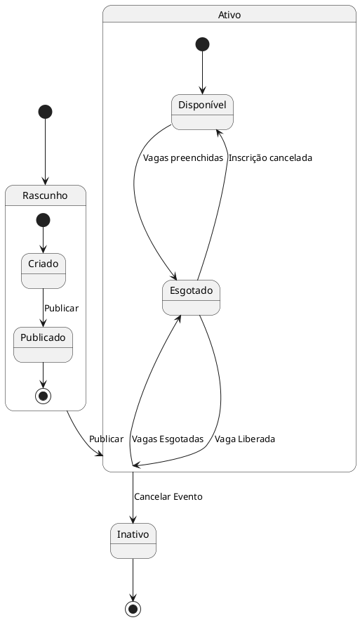

## Responsabilidades dos Serviços - Visão geral

* **BFF (Backend For Frontend)**
    - Extrair `usuarioId` do JWT para operações autenticadas
    - Encaminhar atualizações de último login ao serviço de usuários
    - Injetar headers padrão: correlation ID, timestamp
    - Validar tokens JWT
    - Implementar rate limiting por IP
    - Padronizar envelope de respostas

* **Microserviço de Autenticação**
    - Gerenciar tokens (JWT e refresh tokens)
    - Validar credenciais
    - Gerenciar bloqueios por tentativas falhas
    - Notificar serviço de notificações sobre eventos de segurança
    - Registrar logs de operações sensíveis

* **Microserviço de Usuários**
    - Armazenar data/hora do último login
    - Gerenciar status da conta (ativo/inativo)
    - Manter dados do perfil do usuário

* **Microserviço de Notificações**
    - Enviar emails de confirmação
    - Enviar alertas de segurança
    - Gerenciar templates de email

* **Microserviço de Eventos**
    - Gerenciar ciclo de vida dos eventos (criação, edição, exclusão)
    - Controlar status dos eventos (ativo/inativo)
    - Validar capacidade e disponibilidade de vagas
    - Manter informações detalhadas dos eventos
    - Integrar com serviço de upload de imagens para banners
    - Fornecer endpoints de busca e listagem de eventos

* **Microserviço de Inscrições**
    - Gerenciar processo de inscrição em eventos
    - Validar regras de negócio (vagas disponíveis, duplicidade)
    - Atualizar contadores de vagas em tempo real
    - Registrar histórico de inscrições por usuário
    - Notificar serviço de notificações sobre novas inscrições
    - Manter status das inscrições
    - Fornecer endpoints de consulta de inscrições

----


## Convenções e Padrões Específicos do Módulo de Usuários

> **Nota**: Para convenções e padrões comuns do sistema (estrutura de respostas, headers padrão básicos, formato de timestamps, IDs de correlação), consulte o documento de Autenticação.

### 1. Modelo de Dados do Usuário
```json
{
  "usuario": {
    "usuarioId": "UUID",
    "primeiroNome": "string",
    "ultimoNome": "string",
    "documento": {
      "tipo": "CPF",
      "numero": "string"
    },
    "credenciais": {
      "email": "string",
      "perfil": "enum(participante, promotor, admin)"
    },
    "contato": {
      "telefone": "string",
      "emailContato": "string"
    },
    "dataNascimento": "ISO-8601",
    "dataCadastro": "ISO-8601",
    "dataUltimaAtualizacao": "ISO-8601",
    "status": "enum(ativo, inativo, bloqueado, excluido)"
  },
  "endereco": {
    "logradouro": "string",
    "numero": "string",
    "complemento": "string",
    "cidade": "string",
    "estado": "string",
    "cep": "string"
  }
}
```
### 2. Validações de Dados

#### 2.1 Dados Pessoais
- **Nome**: 2-50 caracteres, apenas letras e espaços
- **CPF**: Formato válido com dígitos verificadores
- **Email**: RFC 5322, máximo 100 caracteres
- **Telefone**: Formato BR (+55 XX XXXXX-XXXX)
- **Data de Nascimento**: ISO-8601, mínimo 18 anos

#### 2.2 Endereço
- **CEP**: Formato BR (XXXXX-XXX)
- **Estado**: Siglas válidas BR (2 caracteres)
- **Cidade**: 2-50 caracteres, apenas letras e espaços
- **Logradouro**: 3-100 caracteres
- **Número**: Valor numérico válido

### 3. Controle de Acesso

#### 3.1 Perfis de Usuário
- **Participante**: Acesso básico (padrão)
- **Promotor**: Pode criar e gerenciar eventos
- **Admin**: Acesso total ao sistema

#### 3.2 Operações por Perfil
- **Participante**: Leitura e atualização do próprio perfil
- **Promotor**: Mesmo que participante + criar eventos
- **Admin**: Todas as operações, incluindo gestão de usuários

### 4. Políticas de Dados e Segurança

#### 4.1 Auditoria
- Registro detalhado de todas as alterações em dados pessoais
- Histórico completo de mudanças de perfil (promoção/rebaixamento)
- Log de alterações de status da conta

#### 4.2 Privacidade e Retenção
- Mascaramento de CPF em respostas públicas
- Retenção de dados pessoais por 5 anos após exclusão da conta
- Logs de auditoria retidos por 1 ano
- Exportação de dados pessoais sob demanda (LGPD)
- Backup diário incremental dos dados de usuários

#### 4.3 Rate Limits Específicos
> Complementares aos limites globais definidos no módulo de Autenticação
- Alteração de dados pessoais: 10 por usuário/hora
- Operações administrativas em perfis: 50 por admin/hora


### Diagrama de Ciclo de Vida do Evento

O diagrama a seguir ilustra os possíveis estados de um evento e as transições entre eles.



## Convenções e Padrões

### Estrutura de Respostas

Todas as respostas da API devem seguir a estrutura:

```json
{
  "sucesso": "true | false",
  "mensagem": "Mensagem descritiva da operação",
  "dados": {                    // apenas em respostas 2xx
      
  },
  "erros": [                   // apenas em respostas 4xx e 5xx
    {
      "campo": "nomeCanpo",
      "mensagem": "Descrição do erro no campo."
    }
  ],
  "timestamp": "2025-08-17T14:30:00Z",
  "correlationId": "550e8400-e29b-41d4-a716-446655440000"
}
```

*Exemplo: 400 Bad Request - Capacidade inválida*
```json
{
  "sucesso": false,
  "mensagem": "Erro ao criar evento.",
  "erros": [
    {
      "campo": "capacidade",
      "mensagem": "Capacidade deve ser um número entre 1 e 10.000."
    },
    {
      "campo": "dataInicio",
      "mensagem": "Data de início deve ser pelo menos 1 hora no futuro."
    }
  ],
  "timestamp": "2025-08-17T14:30:00Z",
  "correlationId": "550e8400-e29b-41d4-a716-446655440000"
}  
```

### Headers Padrão

* `X-Correlation-ID`: UUID v4 para rastreamento da requisição
* `Authorization`: Bearer token para endpoints autenticados
* `User-Agent`: Identificação do cliente
* `X-Forwarded-For`: IP original do cliente
* `Content-Type`: application/json para requests com body

### Validações e Segurança

* **Validação de Dados**
    - Títulos: 5-100 caracteres, apenas letras, números, espaços e pontuação básica
    - Descrições: 10-500 caracteres
    - Datas: formato ISO 8601 (YYYY-MM-DDTHH:mm:ssZ)
    - **Timezone**: Todas as datas e horas devem ser enviadas e retornadas em UTC para garantir consistência.
    - Preços: números decimais de 0.00 a 9999.99
    - URLs: validação de formato e protocolos permitidos (https)

* **Controle de Acesso**
    - Apenas promotores podem criar/editar/excluir eventos
    - Validação de propriedade do evento para operações de modificação
    - Rate limiting específico por tipo de operação

* **Auditoria**
    - Log de todas as operações de CRUD
    - Rastreamento de alterações com usuário e timestamp
    - Correlation ID para rastreamento de requisições

### Rate Limiting e Retry

* **Rate Limits**
    - Criação de eventos: 10 eventos por promotor por hora
    - Listagem de eventos: 100 requisições por IP por minuto
    - Detalhes de evento: 200 requisições por IP por minuto
    - Filtros e buscas: 50 requisições por IP por minuto
    - Edição de eventos: 20 edições por promotor por hora

* **Cache**
    - Listagem de eventos: 5 minutos
    - Detalhes de evento: 2 minutos
    - Resultados de filtros: 3 minutos

* **Retry**
    - Backoff exponencial: 1s, 2s, 4s, 8s, 16s
    - Máximo de 5 tentativas
    - Apenas para erros 5xx
    - Timeout de requisição: 30 segundos


## Convenções e Padrões

### Estrutura de Respostas

Todas as respostas da API devem seguir a estrutura:

```json
{
  "sucesso": "true | false",
  "mensagem": "Mensagem descritiva da operação",
  "dados": {                    // apenas em respostas 2xx
      
  },
  "erros": [                   // apenas em respostas 5xx
    {
      "campo": "senhaAtual",
      "mensagem": "Senha atual incorreta."
    }
  ],
  "timestamp": "2025-08-12T14:30:00Z",
  "correlationId": "550e8400-e29b-41d4-a716-446655440000"
}
```

*Exemplo: 400 Bad Request - Nova senha inválida*
```json
{
  "sucesso": false,
  "mensagem": "Erro ao alterar senha.",
  "erros": [
    {
      "campo": "novaSenha",
      "mensagem": "A nova senha deve conter pelo menos 8 caracteres, incluindo letras maiúsculas, minúsculas, números e caracteres especiais."
    }
  ],
  "timestamp": "2025-08-12T14:30:00Z",
  "correlationId": "550e8400-e29b-41d4-a716-446655440000"
}  
```

### Headers Padrão

* `X-Correlation-ID`: UUID v4 para rastreamento da requisição
* `Authorization`: Bearer token para endpoints autenticados
* `User-Agent`: Identificação do cliente
* `X-Forwarded-For`: IP original do cliente

### Tokens e Segurança

* **Access Token (JWT)**
    - Validade: 1 hora
    - Assinatura: RS256
    - Claims obrigatórias: `sub` (usuarioId), `roles`, `name`, `exp`, `iat`, `iss`

* **Refresh Token**
    - Validade: 7 dias
    - Armazenamento: Banco de dados
    - Um usuário pode ter múltiplos refresh tokens ativos

### Rate Limiting e Retry

* **Rate Limits**
    - Login: 5 tentativas por IP a cada 15 minutos
    - Recuperação de senha: 3 tentativas por email a cada 60 minutos
    - Demais endpoints: 100 requisições por minuto por IP

* **Retry**
    - Backoff exponencial: 1s, 2s, 4s, 8s, 16s
    - Máximo de 5 tentativas
    - Apenas para erros 5xx